# ATNS preservation

Data extracted from the Agreements, Treaties and Negotiated Settlements website.

## Resource model

The preserved ATNS data is a graph rather than a set of isolated records. The
diagram below shows the principal connections, including how an external
creative work can cite an ATNS agreement. Boxes containing example values are
resources with their own IRIs; predicates are shown on the connecting arrows.

The editable [Mermaid source](docs/atns-resource-model.mmd) is kept alongside
the rendered diagram.

`atns:EntityRelationship` is deliberately represented as a resource, rather
than as a direct edge between two entities. This preserves the original ATNS
relationship row and allows its type and source identifier to be described.
The subject and object directions are those recorded by ATNS; an agreement may
occur in either position. Classification values such as category, country and
relationship type are also resources, allowing stable identifiers and labels
to be reused across records.

[ATNS website](https://www.atns.net.au)

Copyright ATNS 2020.  ATNS is maintained by the Indigenous Studies Unit at The University of Melbourne. 
This work is licensed under a Creative Commons Attribution-Non Commercial-No Derivatives 4.0 International License.
